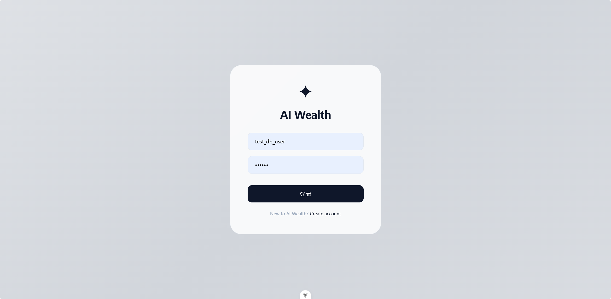
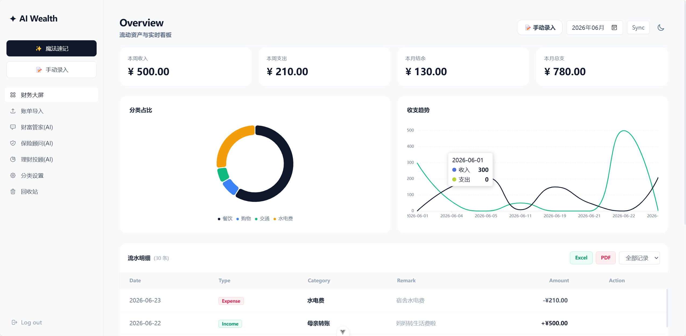
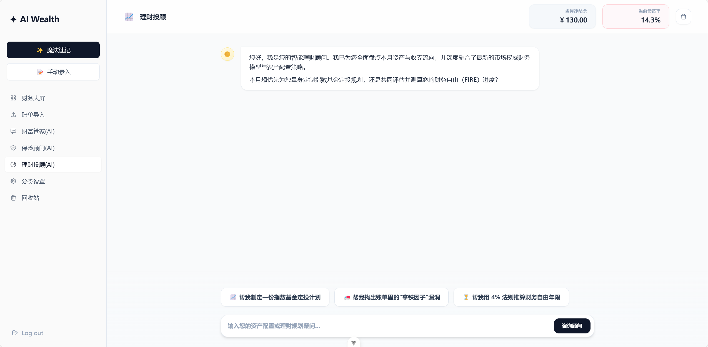
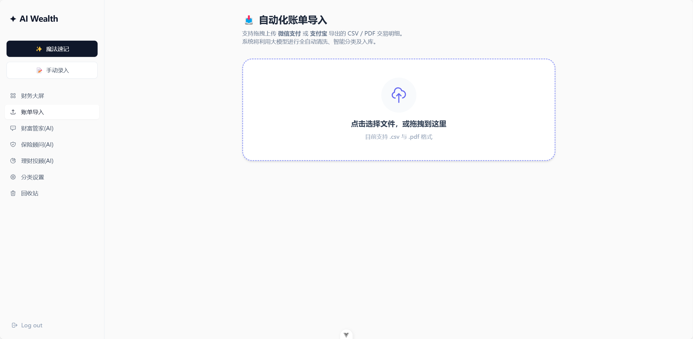
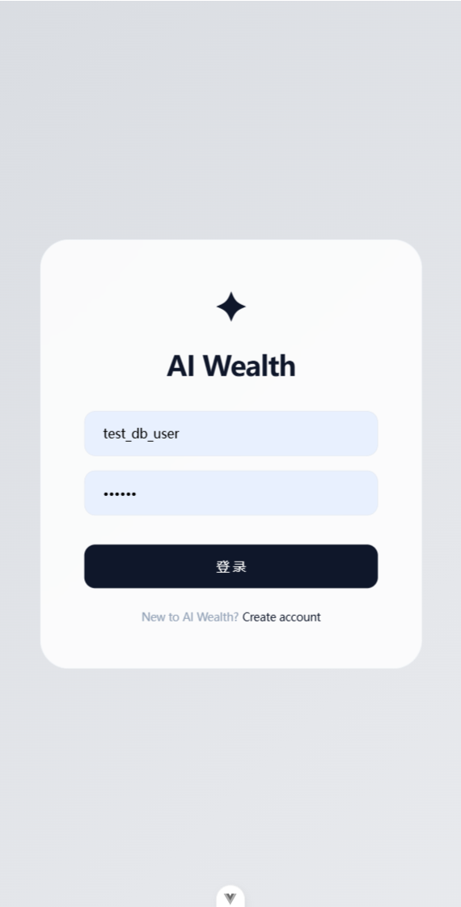
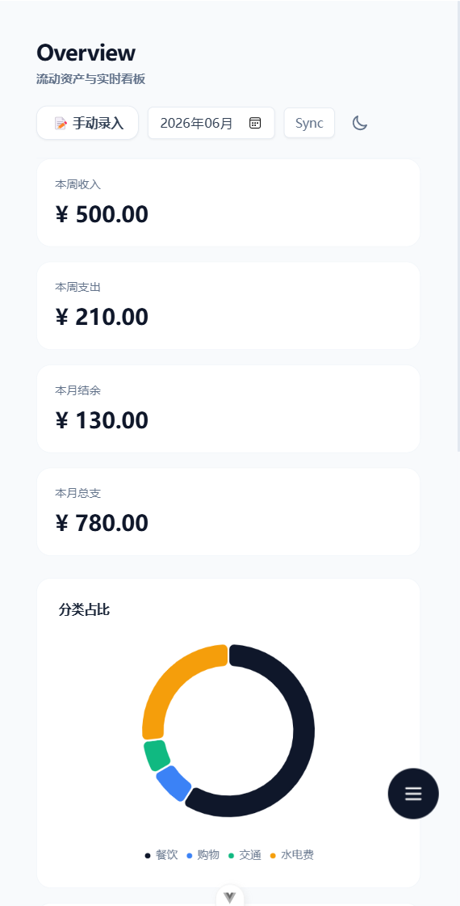
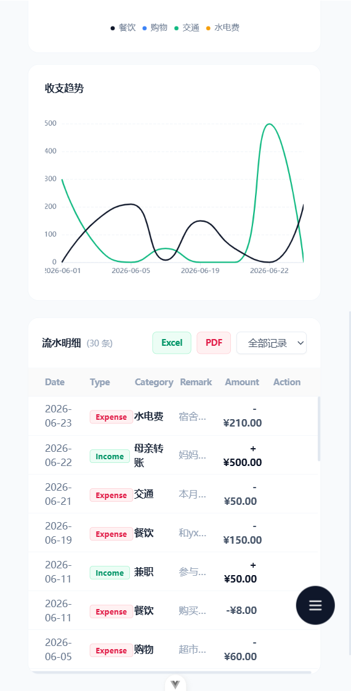
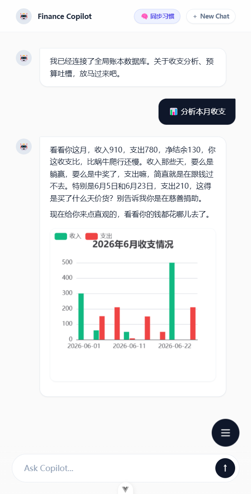

# AI-Wealth 智能财务管家（前端）

基于 **Vue 3 + Vite + Tailwind CSS** 构建的 AI 驱动个人财务管理系统。后端通过 FastAPI 提供 SSE 流式接口与 WebSocket 实时推送，前端实现数据大屏、智能对话与全自动账单导入。

---

## ✨ 核心功能

### 📊 财务大屏

- 实时收支概览（本周/本月）
- ECharts 分类占比饼图 + 收支趋势折线图
- **虚拟滚动**支持海量账单列表（10,000+ 条流畅滚动）
- 一键导出 Excel / PDF

### 🤖 三位 AI 助手

| 助手         | 能力                                            | 技术特点                        |
| :----------- | :---------------------------------------------- | :------------------------------ |
| **财富管家** | 自然语言查询收支、消费吐槽、预算建议            | SSE 流式响应 + Function Calling |
| **保险顾问** | 保险条款精准问答、理赔条件查询                  | RAG 向量检索 + 知识库问答       |
| **理财投顾** | 结合真实收支的资产配置、定投规划、FIRE 进度推算 | 用户财务数据 + 市场理论融合     |

### 📥 全自动账单导入

- 支持微信/支付宝导出的 **CSV / PDF** 拖拽或点击上传
- **WebSocket** 实时推送解析进度（物理解析 → AI 分类 → 入库）
- 后端 AI 自动分类打标，无需手动整理

### 🎨 深色/浅色模式

- 系统自动感知 + 手动切换，双主题适配

---

## 📸 界面预览

### 💻 PC 端

|            登录页             |              财务大屏               |
| :---------------------------: | :---------------------------------: |
|  |  |

|              AI 理财投顾               |             账单导入             |
| :------------------------------------: | :------------------------------: |
|  |  |

### 📱 移动端适配

|                  登录页                  |                   财务大屏1                   |                   财务大屏2                   |                     财富管家                      |
| :--------------------------------------: | :-------------------------------------------: | :-------------------------------------------: | :-----------------------------------------------: |
|  |  |  |  |

---

## 🛠️ 技术栈

| 类别     | 技术                                         |
| :------- | :------------------------------------------- |
| 框架     | Vue 3 (Composition API) + Vite               |
| 状态管理 | Pinia                                        |
| UI 样式  | Tailwind CSS + 自定义组件                    |
| 图表     | ECharts                                      |
| 实时通信 | SSE (流式对话) + WebSocket (进度推送)        |
| 导出     | xlsx (Excel) + jspdf + jspdf-autotable (PDF) |
| 构建工具 | Vite                                         |

---

## 🚀 快速启动

### 1. 克隆仓库

```bash
git clone https://github.com/2217959060/AI-Wealth-Frontend.git
cd AI-Wealth-Frontend
```

### 2. 安装依赖

```bash
npm install
```

### 3. 配置后端地址（默认已配置）

- 打开 `src/api/index.js`
- 确认 `API_BASE` 指向你的后端地址（默认 `http://127.0.0.1:8000`）

### 4. 启动开发服务器

```bash
npm run dev
```

### 5. 访问

打开 `http://localhost:3000`，使用注册功能创建账号后登录。

---

## 📁 项目目录结构

```
src/
├── api/              # API 请求封装
├── assets/           # 静态资源 + 全局样式
├── components/       # 可复用组件
│   ├── DashboardTab.vue    # 财务大屏
│   ├── FinanceAITab.vue    # 财富管家
│   ├── RagAITab.vue        # 保险顾问
│   ├── InvestAITab.vue     # 理财投顾
│   ├── ImportTab.vue       # 账单导入
│   ├── TrashTab.vue        # 回收站
│   ├── CategoryTab.vue     # 分类设置
│   ├── AiChart.vue         # ECharts 图表组件
│   ├── AiAddModal.vue      # AI 速记弹窗
│   └── ManualAddModal.vue  # 手动录入弹窗
├── stores/           # Pinia 状态管理
├── views/            # 页面视图
│   ├── HomeView.vue        # 主界面
│   └── LoginView.vue       # 登录/注册
├── workers/          # Web Worker（Excel 导出）
├── App.vue
├── main.js
└── router/
```

---

## 🔗 相关仓库

- **后端仓库**：[AI-Wealth-Backend](https://github.com/2217959060/AI-Wealth-Backend)

---

## 📬 项目作者

- **GitHub**：[2217959060](https://github.com/2217959060)
- 该项目展示了 **Vue 3 全栈开发能力**、**AI 应用集成经验** 与 **移动端响应式设计**。

> ⚡ 本项目仅用于个人技术展示与面试交流。
